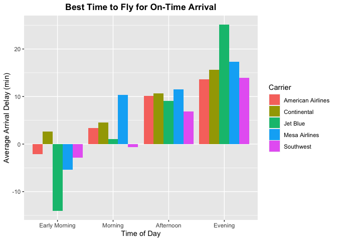
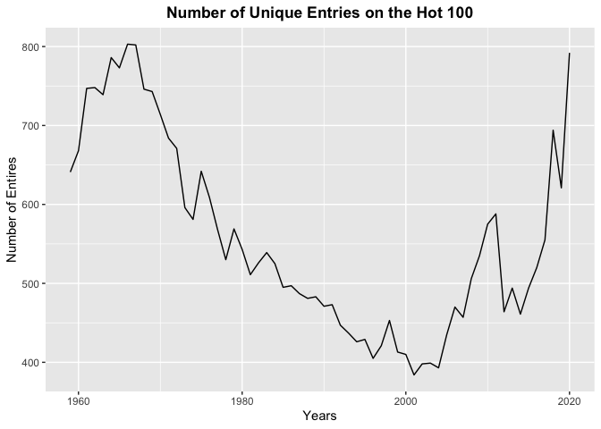
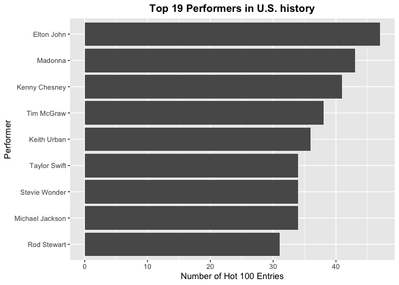
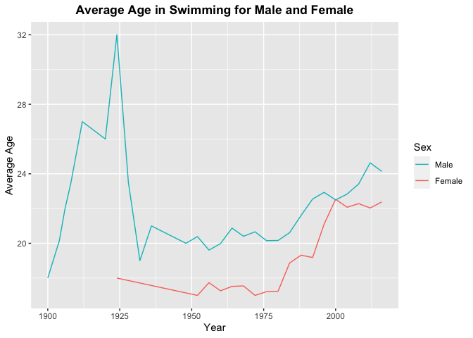
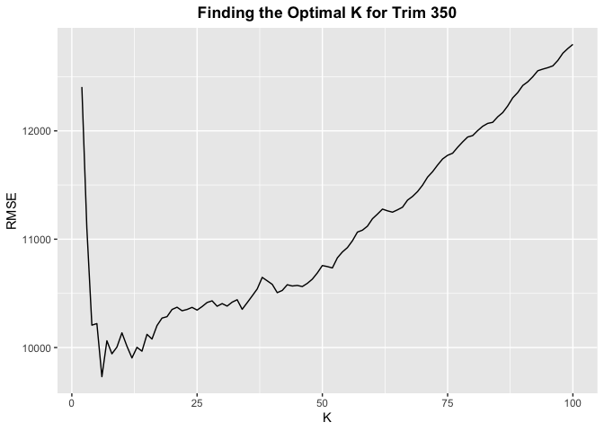
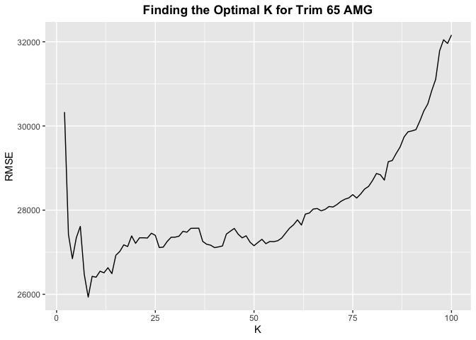

## Problem 1: Data visualization: flights at ABIA

It appears that the best time to fly would be an early morning flight on
Jet Blue, however Jet Blue has the worst arrival delay among evening
flights. In fact, it appears that almost all evening flights have some
sort of delay and that early flights overall are the best choice to
minimize delays.

## Problem 2: Wrangling the Billboard Top 100

### Part A:The Top 10 Most Popular Songs Since 1958

    ## # A tibble: 10 × 3
    ## # Groups:   performer [10]
    ##    performer                              song                             count
    ##    <chr>                                  <chr>                            <int>
    ##  1 Imagine Dragons                        Radioactive                         87
    ##  2 AWOLNATION                             Sail                                79
    ##  3 Jason Mraz                             I'm Yours                           76
    ##  4 The Weeknd                             Blinding Lights                     76
    ##  5 LeAnn Rimes                            How Do I Live                       69
    ##  6 LMFAO Featuring Lauren Bennett & Goon… Party Rock Anthem                   68
    ##  7 OneRepublic                            Counting Stars                      68
    ##  8 Adele                                  Rolling In The Deep                 65
    ##  9 Jewel                                  Foolish Games/You Were Meant Fo…    65
    ## 10 Carrie Underwood                       Before He Cheats                    64

The Top 10 Most Popular Songs Since 1958

### Part B: Musical Diversity

This graph shows the number of Hot 100 Entries from years 1958 to 2021.
The slow decline of song diversity from ~1970 to an all time low in the
early aughts is interesting, and you can clearly see the impact of
iTunes and streaming starting around 2005. Maybe the decline in musical
diversity in the 20th century could be attributed to a consolidation of
genres in the zeitgeist.

### Part C: Ten-Week Hit

## Problem 3: Wrangling the Olympics

### Part A

    ## [[1]]
    ## # A tibble: 27 × 2
    ##    event                                       pct95_athletics
    ##    <chr>                                                 <dbl>
    ##  1 Athletics Women's 1,500 metres                         172 
    ##  2 Athletics Women's 10 kilometres Walk                   170 
    ##  3 Athletics Women's 10,000 metres                        168.
    ##  4 Athletics Women's 100 metres                           180.
    ##  5 Athletics Women's 100 metres Hurdles                   176 
    ##  6 Athletics Women's 20 kilometres Walk                   173 
    ##  7 Athletics Women's 200 metres                           180 
    ##  8 Athletics Women's 3,000 metres                         170 
    ##  9 Athletics Women's 3,000 metres Steeplechase            177.
    ## 10 Athletics Women's 4 x 100 metres Relay                 176 
    ## # … with 17 more rows

### Part B

    ## # A tibble: 1 × 2
    ##   event                      sd_height
    ##   <chr>                          <dbl>
    ## 1 Rowing Women's Coxed Fours      10.9

The women’s event with the greatest variability in height was the Rowing
Coxed Fours.

### Part C

With a strange uptick in age in the men’s event in the 1920’s. It
appears that the average age for men has trended upwards throughout the
years, with the late teen/early twenties being the norm for most of the
20th century and mid-twenties being the norm in the 21st century. A
similar pattern emerges in the women’s event as well, with the mid-late
teens being the norm for most of the 20th century, with a steep uptick
in the late 20th century that put the average female age into the early
20’s. An explanation for these upward trends could be that as healthcare
and training methods improve, people are able to compete at the Olympic
level for longer. Comparatively, it appears that the average age for men
has trended very steadily while the average age for women has a steeper
upward trend.

## Problem 4: K-nearest neighbors

#### For Trim 350

Aftering balacning the biases, we dedcided to use 30 as the optimal k
for trim 350

#### For Trim 65 AMG

Aftering balacning the biases, we dedcided to use 15 as the optimal k
for trim 65 AMG

#### Which trim yields a larger optimal value of K?

    ## [1] 416

    ## [1] 292

Trim 350 has 416 observations and Trim 65 AMG has 292, Trim 350 has a
larger data size so it can accommodate a larger K to get a smoother line
without having too much bias in our prediction.
