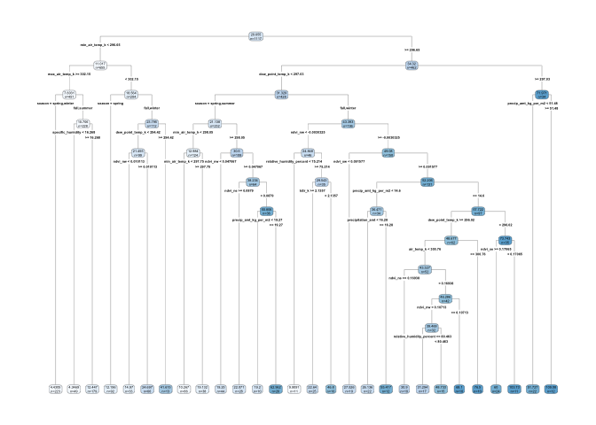

## Problem 1: What Causes What?

1.  There’s a causality problem, it’s hard to come to a clear conclusion
    just by looking at police force size. Cities with higher than
    average crime rate might hire more police than an average city, this
    might lead to a false conclusion that police are ineffective at
    solving crime. On the other hand, having more police means that
    crime gets more easily detected, this might lead someone to conclude
    crime rates are higher when in fact that might be the same as any
    other city with a smaller police force. Simply put, it’s hard to
    conclude what effect increased policing has on crime.

2.  Basically, the researchers added an IV variable by using the terror
    alert system. High Terror alert means that there will be an
    increased police presence regardless of the amount of crime that’s
    happening in a given area. In their first regression they found that
    a high terror alert is predicted to lower the number of crime by
    about 7 crimes. In the second regression, controlling for metro
    ridership, the high terror alert is predicted to lower the crime
    rate by about 6 crimes.  

3.  The researchers decided to control for metro ridership to make sure
    that the lower crime rate caused by the high terror rate wasn’t
    simply a matter of a smaller amount of people being out and about on
    the street. The researchers were trying to capture the effect that a
    high terror rate could have on the amount of people in the city.

4.  The first column comprises of a linear model using robust regression
    with three coefficients. One of the coefficients looks at the effect
    of a high terror rate solely within the first police district area,
    meaning the national mall. This is because if terrorists were to
    attack Washington, D.C. they would probably focus on this area. The
    next coefficient is the effect of the high alert on the rest of the
    police district areas within DC. The third coefficient is the log of
    midday metro ridership. Basically this regression is showing that
    the high alert (and therefore an increased number of police) lowers
    crime mostly in the National Mall area, the effect in the rest of
    the city isn’t as profound as it is in the other area, even though
    it still lowers crime by a small amount. However, the regression
    still shows strong evidence that more police lowers crime, this is
    because during a high alert the DC police force is probably going to
    increase police the most in district one.

## Problem 2 Tree Modeling: Dengue Cases

### Part 1: CART

The model above shows the un-pruned CART Tree, we will proceed to prune
and then calculate RMSE.

    ## 28.88963  RMSE for Pruned CART Model

### Part 2: Random Forest

This plot shows the out of bag MSE as a function of the number of trees
used. Let’s proceed to look at the RMSE compared to the testing set.

    ## 23.8701  RMSE for Random Forest

### Part 3: Gradient Boosted Trees

    ## [1] 48

This plot shows the error curve of the Gradient Boosted Model. Along
with the optimal number of trees listed as output. Let’s now check the
RMSE for the Gradient Boosted Trees Model.

    ## 24.89892  RMSE for Gradient Boosted Trees

Looking at the RMSE results from the three models, it appears that
random forest would be the best choice for this particular set of data.
The next section shows the partial dependency plots for the Random
Forest Model.

### Part 4: Partial Dependency Plots

### Wrap Up:

Looking at the PD plots, most seem to make sense in the context of the
science of mosquito breeding. Mosquitos require standing water in order
to make baby mosquitos, it makes sense that as precipitation increases,
the number of mosquitos increases, the increased number of mosquitos
leads to more cases of Dengue. The same seems to be true of humidity.
Humidity is a measure of how much evaporated moisture there is in the
air, higher humidity would seem to indicate that there is a higher
amount of water on the ground, and thus the amount of mosquito breeding
grounds. Our wild card PD plot looks at the Average Diurnal Temperature
Range. It shows that as DTR increases, the amount of predicted Dengue
cases decreases. This makes sense as well, it’s possible that
temperature shocks kill mosquitos which leads to less Dengue cases.
