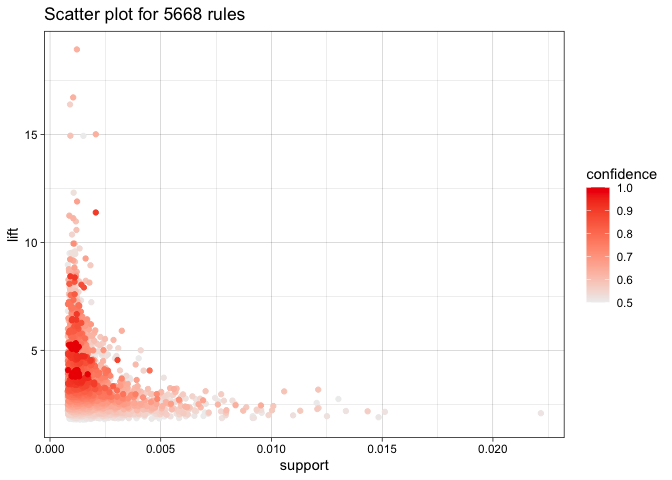
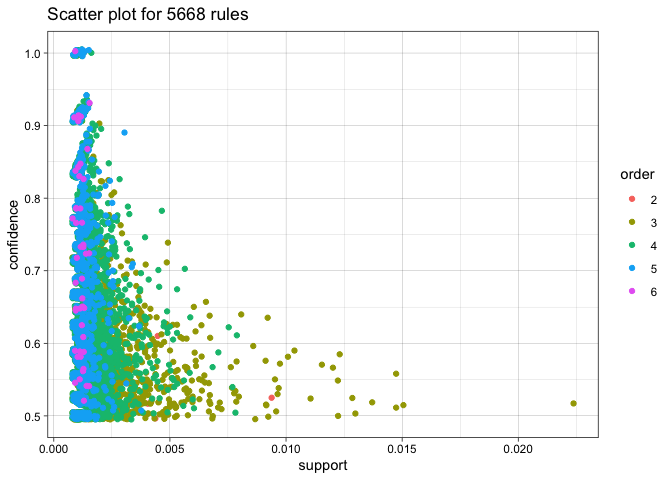
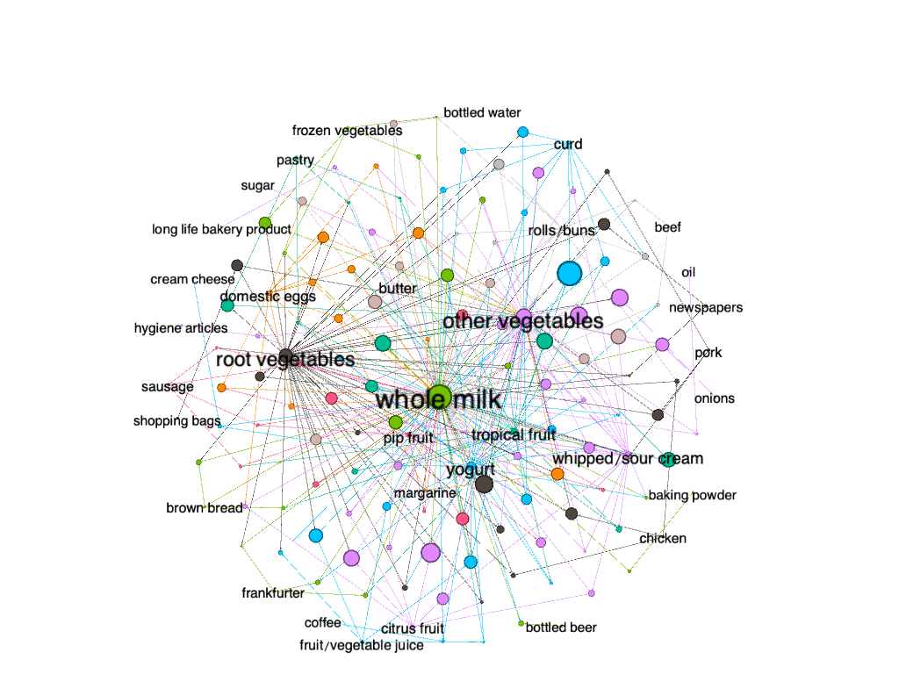

## Problem 3

### Association rules for grocery purchases

Initially, it seemed like the best option to include relatively high
thresholds for both support and confidence. This approach seems to make
sense, because support can tell us what rules are worth exploring
further. However, when using a minimum support threshold of .005 and
confidence of .5 we didn’t seem to get very show-stopping results.
Simply put, we basically determined that people buy whole milk and
“other vegetables” when they buy other items. Given the sheer popularity
of milk and vegetables, this isn’t a very compelling or interesting
result. Max item length was set at 10, this is because people typically
purchase a lot of items at once when grocery shopping, and we didn’t
want to miss any potentially interesting combinations.

The confidence threshold was set at .5, which may seem high, but setting
confidence higher was done to offset the “milk” factor and to truly
extract surprising results. Because milk is such popular item, many
rules that involve milk and another item will have high confidence even
if the lift isn’t very high.

After the disappointing results using .005 minimum support, we adjusted
our minimum support to be .001 while keeping confidence and max item
length the same. After extracting the rules, we looked at rules with a
lift &gt; 10 and this resulted in some interesting, but not entirely
surprising associations.

**The 15 rules with lift greater than 10 are listed below:**

<table style="width:100%;">
<caption>Rules with lift over 10</caption>
<colgroup>
<col style="width: 53%" />
<col style="width: 12%" />
<col style="width: 7%" />
<col style="width: 8%" />
<col style="width: 7%" />
<col style="width: 6%" />
<col style="width: 4%" />
</colgroup>
<thead>
<tr class="header">
<th style="text-align: left;">LHS</th>
<th style="text-align: left;">RHS</th>
<th style="text-align: right;">support</th>
<th style="text-align: right;">confidence</th>
<th style="text-align: right;">coverage</th>
<th style="text-align: right;">lift</th>
<th style="text-align: right;">count</th>
</tr>
</thead>
<tbody>
<tr class="odd">
<td style="text-align: left;">{liquor,red/blush wine}</td>
<td style="text-align: left;">{bottled beer}</td>
<td style="text-align: right;">0.0019317</td>
<td style="text-align: right;">0.9047619</td>
<td style="text-align: right;">0.0021350</td>
<td style="text-align: right;">11.23641</td>
<td style="text-align: right;">19</td>
</tr>
<tr class="even">
<td style="text-align: left;">{popcorn,soda}</td>
<td style="text-align: left;">{salty snack}</td>
<td style="text-align: right;">0.0012200</td>
<td style="text-align: right;">0.6315789</td>
<td style="text-align: right;">0.0019317</td>
<td style="text-align: right;">16.69949</td>
<td style="text-align: right;">12</td>
</tr>
<tr class="odd">
<td style="text-align: left;">{Instant food products,soda}</td>
<td style="text-align: left;">{hamburger meat}</td>
<td style="text-align: right;">0.0012200</td>
<td style="text-align: right;">0.6315789</td>
<td style="text-align: right;">0.0019317</td>
<td style="text-align: right;">18.99759</td>
<td style="text-align: right;">12</td>
</tr>
<tr class="even">
<td style="text-align: left;">{Instant food products,whole milk}</td>
<td style="text-align: left;">{hamburger meat}</td>
<td style="text-align: right;">0.0015250</td>
<td style="text-align: right;">0.5000000</td>
<td style="text-align: right;">0.0030500</td>
<td style="text-align: right;">15.03976</td>
<td style="text-align: right;">15</td>
</tr>
<tr class="odd">
<td style="text-align: left;">{ham,processed cheese}</td>
<td style="text-align: left;">{white bread}</td>
<td style="text-align: right;">0.0019317</td>
<td style="text-align: right;">0.6333333</td>
<td style="text-align: right;">0.0030500</td>
<td style="text-align: right;">15.04702</td>
<td style="text-align: right;">19</td>
</tr>
<tr class="even">
<td style="text-align: left;">{domestic eggs,processed cheese}</td>
<td style="text-align: left;">{white bread}</td>
<td style="text-align: right;">0.0011183</td>
<td style="text-align: right;">0.5238095</td>
<td style="text-align: right;">0.0021350</td>
<td style="text-align: right;">12.44490</td>
<td style="text-align: right;">11</td>
</tr>
<tr class="odd">
<td style="text-align: left;">{baking powder,flour}</td>
<td style="text-align: left;">{sugar}</td>
<td style="text-align: right;">0.0010167</td>
<td style="text-align: right;">0.5555556</td>
<td style="text-align: right;">0.0018300</td>
<td style="text-align: right;">16.40974</td>
<td style="text-align: right;">10</td>
</tr>
<tr class="even">
<td style="text-align: left;">{hard cheese,whipped/sour cream,yogurt}</td>
<td style="text-align: left;">{butter}</td>
<td style="text-align: right;">0.0010167</td>
<td style="text-align: right;">0.5882353</td>
<td style="text-align: right;">0.0017283</td>
<td style="text-align: right;">10.61630</td>
<td style="text-align: right;">10</td>
</tr>
<tr class="odd">
<td style="text-align: left;">{hamburger meat,whipped/sour cream,yogurt}</td>
<td style="text-align: left;">{butter}</td>
<td style="text-align: right;">0.0010167</td>
<td style="text-align: right;">0.6250000</td>
<td style="text-align: right;">0.0016267</td>
<td style="text-align: right;">11.27982</td>
<td style="text-align: right;">10</td>
</tr>
<tr class="even">
<td style="text-align: left;">{sliced cheese,tropical fruit,whole milk,yogurt}</td>
<td style="text-align: left;">{butter}</td>
<td style="text-align: right;">0.0010167</td>
<td style="text-align: right;">0.5555556</td>
<td style="text-align: right;">0.0018300</td>
<td style="text-align: right;">10.02650</td>
<td style="text-align: right;">10</td>
</tr>
<tr class="odd">
<td style="text-align: left;">{cream cheese ,other vegetables,whipped/sour cream,yogurt}</td>
<td style="text-align: left;">{curd}</td>
<td style="text-align: right;">0.0010167</td>
<td style="text-align: right;">0.5882353</td>
<td style="text-align: right;">0.0017283</td>
<td style="text-align: right;">11.04176</td>
<td style="text-align: right;">10</td>
</tr>
<tr class="even">
<td style="text-align: left;">{curd,other vegetables,whipped/sour cream,yogurt}</td>
<td style="text-align: left;">{cream cheese }</td>
<td style="text-align: right;">0.0010167</td>
<td style="text-align: right;">0.5882353</td>
<td style="text-align: right;">0.0017283</td>
<td style="text-align: right;">14.83560</td>
<td style="text-align: right;">10</td>
</tr>
<tr class="odd">
<td style="text-align: left;">{other vegetables,tropical fruit,white bread,yogurt}</td>
<td style="text-align: left;">{butter}</td>
<td style="text-align: right;">0.0010167</td>
<td style="text-align: right;">0.6666667</td>
<td style="text-align: right;">0.0015250</td>
<td style="text-align: right;">12.03180</td>
<td style="text-align: right;">10</td>
</tr>
<tr class="even">
<td style="text-align: left;">{other vegetables,rolls/buns,root vegetables,tropical fruit,whole milk}</td>
<td style="text-align: left;">{beef}</td>
<td style="text-align: right;">0.0011183</td>
<td style="text-align: right;">0.5500000</td>
<td style="text-align: right;">0.0020333</td>
<td style="text-align: right;">10.48411</td>
<td style="text-align: right;">11</td>
</tr>
<tr class="odd">
<td style="text-align: left;">{domestic eggs,other vegetables,tropical fruit,whole milk,yogurt}</td>
<td style="text-align: left;">{butter}</td>
<td style="text-align: right;">0.0010167</td>
<td style="text-align: right;">0.6250000</td>
<td style="text-align: right;">0.0016267</td>
<td style="text-align: right;">11.27982</td>
<td style="text-align: right;">10</td>
</tr>
</tbody>
</table>

Rules with lift over 10

**Looking at many of the rules, it’s clear that some are compliments
such as:**

{ham, processed cheese} -&gt; white bread

{baking powder, flour} -&gt; sugar

**Other rules might not initially seem like complements, but have clear
associations with each other. The rule with the highest lift seems to
come from people planning parties or cookouts:**

{instant food products, soda} -&gt; hamburger meat

This rule has the highest lift of all the rules we found with 18.998
lift, and may indicate people buying products for cookouts.

{liquor, red/blush wine} -&gt; bottled beer

This rule makes sense for parties. This rule also has a very high
confidence of 0.9047619.

{popcorn, soda} -&gt; salty snack

This rule makes sense because people buy these items for parties and
movie nights

**Finally, the most amusing rule may be:**

{Instant food products, whole milk} -&gt; hamburger meat

This rule may be comprised of people buying the ingredients for the
American household staple Hamburger Helper, which requires boxed
(instant) Hamburger Helper mix, milk, and hamburger meat.

## Graphs

Below are some plots illustrating the ruleset created in the first part
of the question.

Plot 1 shows rules organized by support and lift, with shade intensity
representing confidence.

Plot 2 shows rules organized support and confidence with different
colors representing the order of specific rules.

Plot 3 shows a network plot of rules with confidence &gt; 0.01 and
support &gt; 0.005, this was done to make the network more presentable,
trying to plot all of the rules creates a messy and un-interpretable
network.

